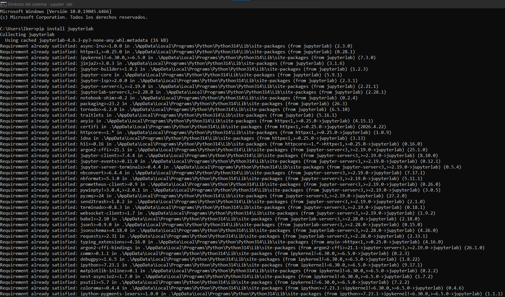
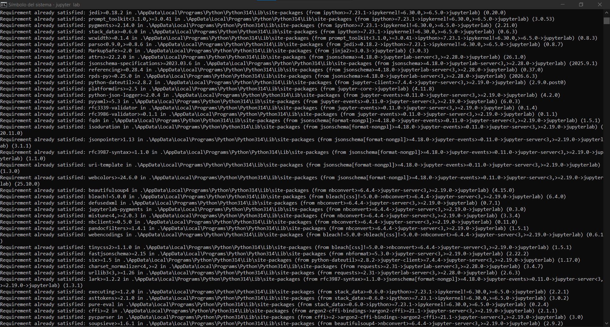
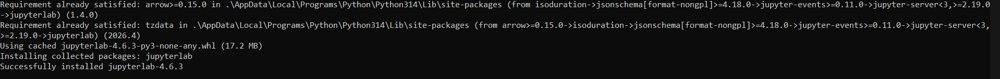
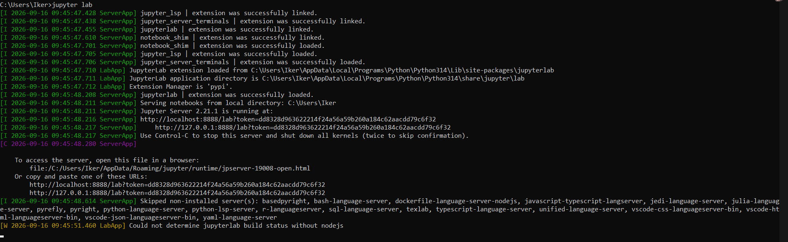
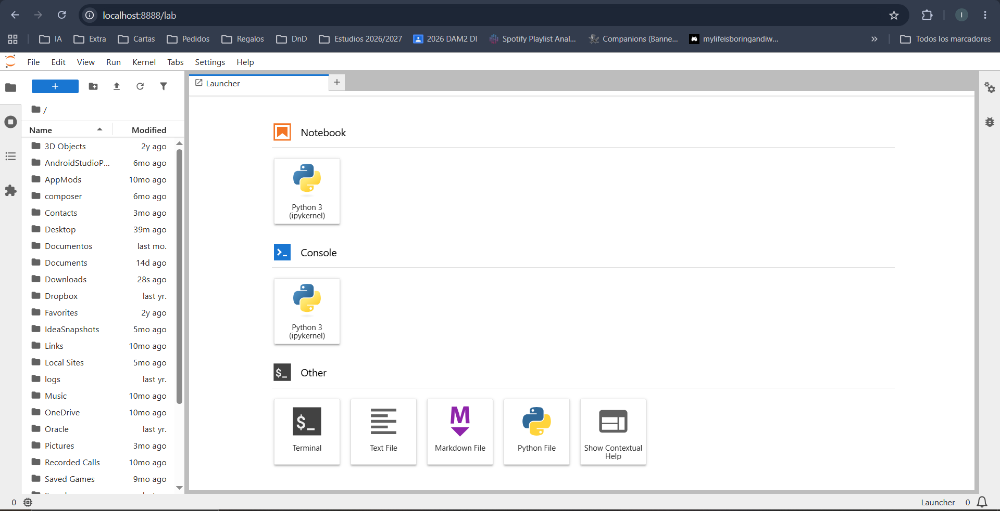
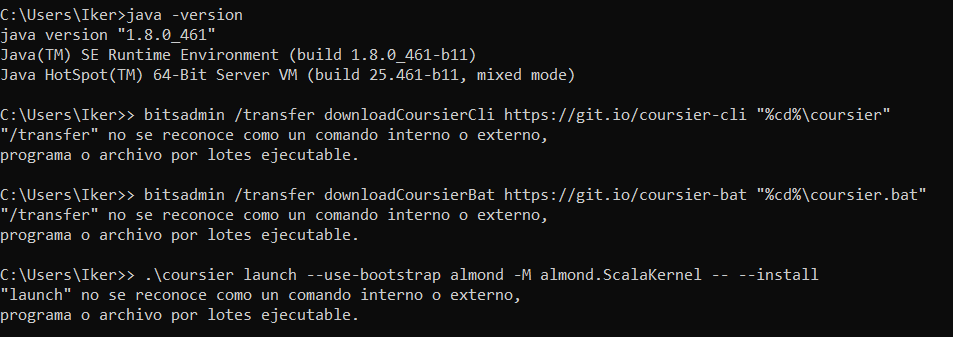

## Entorno 1

Para instalar Jupyter podermos encontrar información en la web: https://jupyter.org/install
Como esta indica ejecutamos el comando "pip install jupyterlab" en nuestro cmd, que comprobará si tenemos todo lo requerido para jupiter y los instalará si no los tenemos.   

Una vez instalado jupyter, hay que usar el comando "jupyter lab" en nuestro cmd , el cual abrirá http://localhost:8888/lab en nuestro navegador, desde donde podremos trabajar con jupyter 
Para instalar almond, entraremos en https://almond.sh/ y haremos click en la opción de install, eso nos llevará a https://almond.sh/docs/quick-start-install.
Te indica que debes tener instalado mínimo Java 1.8.0_121, yo ya lo tengo instalado pero en caso de no tenerlo, te proveé del enlace para descargarlo.
Antes de instalar almond debes de instalar coursier, en la página web indica que hay que usar los comandos:

- bitsadmin /transfer downloadCoursierCli https://git.io/coursier-cli "%cd%\coursier"
- bitsadmin /transfer downloadCoursierBat https://git.io/coursier-bat "%cd%\coursier.bat"
- 
  
  
A mi no me han funcionado, y con ayuda de la IA, se que es por que no son comandos actualizados, en su lugar yo usaré:

- curl -fLo cs-x86_64-pc-win32.zip https://github.com/coursier/launchers/raw/master/cs-x86_64-pc-win32.zip

Extraigo el zip en la carpeta donde lo he descargado.
Aunque no sea obligatorio por consejo de la IA, voy a renombrar lo extraido (cs-x86_64-pc-win32.exe) a cs.exe para mayor comodidad a la hora de ejecutar comandos con:
move cs-x86_64-pc-win32.exe cs.exe
|
Ahora que ya tengo correctamente instalado coursier, puedo instalar almond con

- .\cs launch --use-bootstrap almond -M almond.ScalaKernel --scala 2.12.21 -- --install

  |
  |

Es importante que despues de "almond.ScalaKernel", separado con un espacio se escriba si se quiere una versión especifica de scala como es nuestro caso, si no se instalará la ultima versión (3.8.1)
Una vez instalado almond, podemos comprobar que scala este descargado correctamente para ello volvemos a abrir jupyter lab.
En Jupyter lab, abrimos un cuaderno Scala.

|
|

Y comprobamos la versión, yo en mi caso lo he hecho mediante el comando:

- println("Scala " + scala.util.Properties.versionNumberString)

Terminamos realizando los 3 ejercicios simples indicados en la tarea.

| REVISAR

## Entorno 2

Para instalar java 17 yo lo haré llendo a https://adoptium.net/es/temurin/releases?version=17 desde el que instalaré el OpenJDK17U-jdk_x64_windows_hotspot_17.0.20.1_1.msi
Ejecutamos el instalador y como lo vamos a usar para varias tareas, yo lo voy a poner como JDK predeterminado.
Comprobamos desde la terminal que el Java 17 se haya instalado bien con where java, java -version y javac -version.

Yo el Visual Studio Code ya lo tenía instalado de antes, unicamente tengo que actualizarlo a la última versión la 1.138

Vamos al apartado de extensiones a la derecha de la pantalla y buscamo Scala (Metals) para instalarla.

Para instalar sbt hay que entrar a la terminal y escribir winget install sbt.sbt, y una vez ha sido instalado podemos comprobar que se ha instalado correctamente con sbt --version.

Ahora, tenemos que crear una carpeta que abriremos desde el visual studio code para realizar nuestro proyecto y tendremos que crear las distinas carpetas y archivos para llegar a la siguiente estructura.
Dentro del built.sbt especificamos que usaremos la versión "2.12.21" y que el nombre será "scala-vscode". 
Dentro de Main.scala pegamos el contenido del mini programa de ejemplo
Mientras creabas la estructura del proyecto, metals avisaba de si querías importa el proyecto, ahora es el momento de indicarle que quieres hacerlo aceptando la notificación en la esquina inferior derecha.
Mientras Metals se importa, se van a ir añadiendo muchas carpetas y archivos en distintos niveles del proyecto, las primeras capas se verán algo así
Una vez compliado completamente vamos a abrir una terminal y nos vamos a mover a la localización del proyecto, una vez estemos dentro de la carpeta base, vamos a compilarlo con "sbt compile" y una vez se compile correctamente probaremos a ejecutarlo desde la misma localizacion con sbt run

## Entorno 3

Para iniciar este ejercicio, la practica pide instalar el Intellij IDEA, pero yo ya lo tenía instalado de antes, por lo que no puedo mostrar la instalación.
Para instalar el plugin de Scala, entramos en las pestaña de nuevo proyecto y damos en manejar más los plugins de los generadores, donde está Scala. Desde ahí entramos e instalamos el plugin. 
Volvemos al apartado de crear proyecto, seleccionamos Scala como Generator y cambiamos el JDK en el desplegable en el centro del menu.
Le cambiamos el nombre del proyecto a scala-intellij y cambiamos la versión de Scala a la 2.12.21 y creamos el proyecto.

Una vez creado el proyecto podemos ver que el build contiene todo lo que requiere la tarea, creamos el archivo en la ruta indicada.
Una vez en el archivo, nos pedirán que volvamos a configurar el SDK para Scala, elegimos el 2.12.21
Copiamos el contenido del ejercicio y ejecutamos desde el Intellij, una vez vemos que no ha habido errores, abrimos el proyecto desde un cmd, y al igual que en el ejercicio del entorno anterior compilamos y ejecutamos con sbt.
